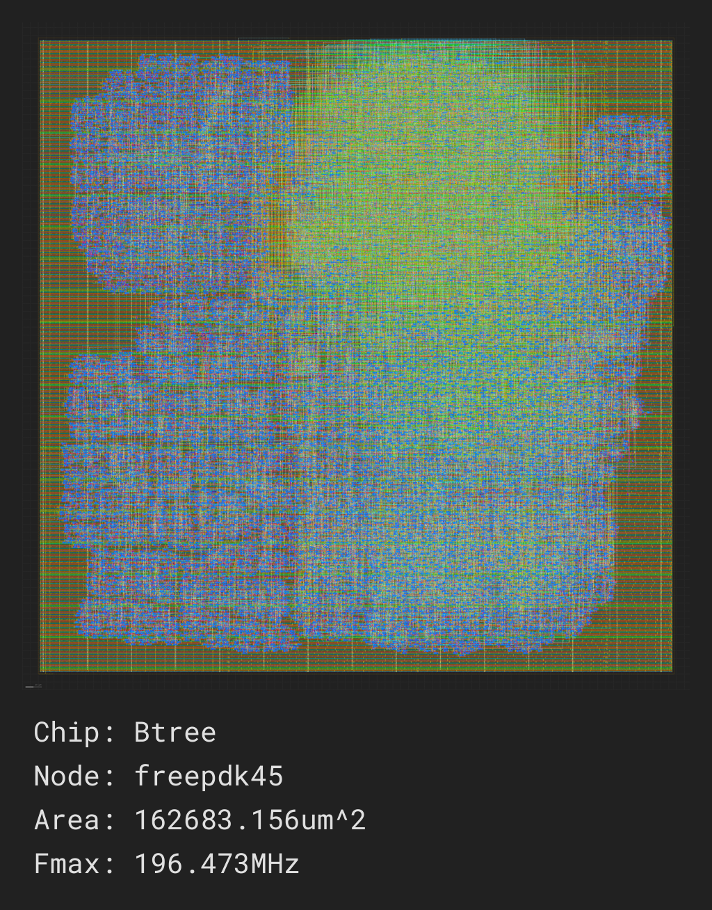

   

# Goal

Use Java to generate synthesizable Verilog to layout a [B-Tree](https://en.wikipedia.org/wiki/B-tree) on the surface of
a specialized [Silicon](https://en.wikipedia.org/wiki/Silicon) [chip](https://en.wikipedia.org/wiki/Integrated_circuit) so that the [find](https://en.wikipedia.org/wiki/Find_(Unix)), put and delete operations on a [B-Tree](https://en.wikipedia.org/wiki/B-tree) can be performed more quickly than [software](https://en.wikipedia.org/wiki/Software) running on a generic
processor.

---

# Chip

A [chip](https://en.wikipedia.org/wiki/Integrated_circuit) implements an [algorithm](https://en.wikipedia.org/wiki/Algorithm) in [Silicon](https://en.wikipedia.org/wiki/Silicon). 
A [chip](https://en.wikipedia.org/wiki/Integrated_circuit) design exists in one of two states:

- **Design**: The stage where the layout of the [chip](https://en.wikipedia.org/wiki/Integrated_circuit) is defined on [Silicon](https://en.wikipedia.org/wiki/Silicon). 
- **Execution**: When the [chip](https://en.wikipedia.org/wiki/Integrated_circuit) runs a fixed set of parallel [processes](https://en.wikipedia.org/wiki/Process_management_(computing)) to perform work.

## Process

Each [process](https://en.wikipedia.org/wiki/Process_management_(computing)) is assigned a unique identifier at design time. A [process](https://en.wikipedia.org/wiki/Process_management_(computing)) includes:

- A [program](https://en.wikipedia.org/wiki/Computer_program), which in turn is comprised of [instructions](https://en.wikipedia.org/wiki/Instruction_set_architecture). 
- An optional block of [memory](https://en.wikipedia.org/wiki/Computer_memory) 
- Optional local [registers](https://en.wikipedia.org/wiki/Processor_register) 
### Access Rules

The [Verilog](https://en.wikipedia.org/wiki/Verilog) `always` blocks enforce access rule requirements for [processes](https://en.wikipedia.org/wiki/Process_management_(computing)): 
- A [process](https://en.wikipedia.org/wiki/Process_management_(computing)) can **only write** to its own [memory](https://en.wikipedia.org/wiki/Computer_memory) and [registers](https://en.wikipedia.org/wiki/Processor_register). 
- A [process](https://en.wikipedia.org/wiki/Process_management_(computing)) can **read** its own [registers](https://en.wikipedia.org/wiki/Processor_register) and the [registers](https://en.wikipedia.org/wiki/Processor_register) of **any** other [process](https://en.wikipedia.org/wiki/Process_management_(computing)) .

## Memory

The [memory](https://en.wikipedia.org/wiki/Computer_memory) associated with a [process](https://en.wikipedia.org/wiki/Process_management_(computing)) is comprised of one-dimensional, indexable [arrays](https://en.wikipedia.org/wiki/Dynamic_array): 
- Memory size is determined at **runtime**.

- Memory contents persist even when the [chip](https://en.wikipedia.org/wiki/Integrated_circuit) is not executing.

- Memory is typically accessed over multiple [clock](https://en.wikipedia.org/wiki/Clock_generator) cycles by issuing transactions that copy [memory](https://en.wikipedia.org/wiki/Computer_memory) elements to or from local [registers](https://en.wikipedia.org/wiki/Processor_register) for faster access.

- Each [memory](https://en.wikipedia.org/wiki/Computer_memory) is owned by a single [process](https://en.wikipedia.org/wiki/Process_management_(computing)) .

## Registers

Registers are local blocks of [memory](https://en.wikipedia.org/wiki/Computer_memory) that:

- Have a fixed size determined at **compile time**.

- Are accessible within a **single [clock](https://en.wikipedia.org/wiki/Clock_generator) cycle**.

- Lose their values if the [chip](https://en.wikipedia.org/wiki/Integrated_circuit) is powered off.

## Program Execution

Each [process](https://en.wikipedia.org/wiki/Process_management_(computing)) executes a single [program](https://en.wikipedia.org/wiki/Computer_program) composed of sequential [instructions](https://en.wikipedia.org/wiki/Instruction_set_architecture). A [chip](https://en.wikipedia.org/wiki/Integrated_circuit) may contain multiple [processes](https://en.wikipedia.org/wiki/Process_management_(computing)). 
Processes can be driven by transactions, which are parameter lists of [registers](https://en.wikipedia.org/wiki/Processor_register) provided by the calling [processes](https://en.wikipedia.org/wiki/Process_management_(computing)). 
Processes are execute in a fixed, round-robin order set at design time,
allowing the behavior of the [Verilog](https://en.wikipedia.org/wiki/Verilog) [code](https://en.wikipedia.org/wiki/Computer_program) to be validated by comparing the time
evolution of memories and [registers](https://en.wikipedia.org/wiki/Processor_register) under [Verilog](https://en.wikipedia.org/wiki/Verilog) with the trace of the same
under [Java](https://en.wikipedia.org/wiki/Java_(programming_language)). 
### Transactions

A [transaction](https://en.wikipedia.org/wiki/Database_transaction) enables one [process](https://en.wikipedia.org/wiki/Process_management_(computing)) to request work from another [process](https://en.wikipedia.org/wiki/Process_management_(computing)) using a parameter [list](https://en.wikipedia.org/wiki/Linked_list) comprised of [registers](https://en.wikipedia.org/wiki/Processor_register). 
Processes handle transactions in round-robin polling mode, fixed at design time. Each [process](https://en.wikipedia.org/wiki/Process_management_(computing)): 
1. Polls its inbound transactions for work.

2. When a [transaction](https://en.wikipedia.org/wiki/Database_transaction) is found:

   - Copies data from the transaction's parameter [registers](https://en.wikipedia.org/wiki/Processor_register) into its own [registers](https://en.wikipedia.org/wiki/Processor_register). 
   - Processes the data by excuting the indicated [transaction](https://en.wikipedia.org/wiki/Database_transaction). 
   - Writes the execution results into the transaction's output [registers](https://en.wikipedia.org/wiki/Processor_register). 
   - Marks the [transaction](https://en.wikipedia.org/wiki/Database_transaction) as complete and thius usable by the caller.

3. The requesting [process](https://en.wikipedia.org/wiki/Process_management_(computing)) waits for the completion of a [transaction](https://en.wikipedia.org/wiki/Database_transaction) by spinning on an [instruction](https://en.wikipedia.org/wiki/Instruction_set_architecture). 
The output remains in the [transaction](https://en.wikipedia.org/wiki/Database_transaction) [registers](https://en.wikipedia.org/wiki/Processor_register) until they are overwritten by the next use of the same [transaction](https://en.wikipedia.org/wiki/Database_transaction). 
### Deadlock Prevention

To avoid deadlocks, [processes](https://en.wikipedia.org/wiki/Process_management_(computing)) may only request work from [processes](https://en.wikipedia.org/wiki/Process_management_(computing)) with lower [process](https://en.wikipedia.org/wiki/Process_management_(computing)) numbers.

## Verilog Implementation

The [chip](https://en.wikipedia.org/wiki/Integrated_circuit) is implemented in [Verilog](https://en.wikipedia.org/wiki/Verilog). Each [process](https://en.wikipedia.org/wiki/Process_management_(computing)) is mapped to an `always` block that:

- Executes [instructions](https://en.wikipedia.org/wiki/Instruction_set_architecture) comprising in-flight transactions or polls its non-in-flight transactions for work.

- Is triggered by a common [clock](https://en.wikipedia.org/wiki/Clock_generator) to ensure synchronous execution.

- Shares a common [clock](https://en.wikipedia.org/wiki/Clock_generator) cycle count (step number) across all [processes](https://en.wikipedia.org/wiki/Process_management_(computing)), though each [process](https://en.wikipedia.org/wiki/Process_management_(computing)) has its own [program](https://en.wikipedia.org/wiki/Computer_program) counter.

Programs are implemented using a `case` statement where:

- Each [instruction](https://en.wikipedia.org/wiki/Instruction_set_architecture) corresponds to a case branch.

- Each [process](https://en.wikipedia.org/wiki/Process_management_(computing)) has a [program](https://en.wikipedia.org/wiki/Computer_program) counter that selects the next [instruction](https://en.wikipedia.org/wiki/Instruction_set_architecture) to be executed.

This is **not** a general-purpose processor. It is a specialized [chip](https://en.wikipedia.org/wiki/Integrated_circuit) with **statically optimized** execution paths for minimal time and power consumption.

## Java Simulation

Writing [Verilog](https://en.wikipedia.org/wiki/Verilog) directly is time-consuming and error-prone. To mitigate this problem:

- The [algorithm](https://en.wikipedia.org/wiki/Algorithm) is first written and debugged in [Java](https://en.wikipedia.org/wiki/Java_(programming_language)) using familiar programming paradigms and tools.

- The [Java](https://en.wikipedia.org/wiki/Java_(programming_language)) [code](https://en.wikipedia.org/wiki/Computer_program) is then **almost-automatically translated** into [Verilog](https://en.wikipedia.org/wiki/Verilog). 
- The [Java](https://en.wikipedia.org/wiki/Java_(programming_language)) [code](https://en.wikipedia.org/wiki/Computer_program) is executed to produce a trace showing how the [memory](https://en.wikipedia.org/wiki/Computer_memory) and [registers](https://en.wikipedia.org/wiki/Processor_register) of the chip should evolve in time.

- The [Verilog](https://en.wikipedia.org/wiki/Verilog) [code](https://en.wikipedia.org/wiki/Computer_program) is executed and checked to confirm that it produces the same [memory](https://en.wikipedia.org/wiki/Computer_memory) and [register](https://en.wikipedia.org/wiki/Processor_register) trace as the [Java](https://en.wikipedia.org/wiki/Java_(programming_language)) [code](https://en.wikipedia.org/wiki/Computer_program) does

This approach produces [Verilog](https://en.wikipedia.org/wiki/Verilog) [code](https://en.wikipedia.org/wiki/Computer_program) **more efficiently** and **reliably** than
writing it by hand.

As a consequence, no additional tests are required within the [Verilog](https://en.wikipedia.org/wiki/Verilog) [code](https://en.wikipedia.org/wiki/Computer_program) itself; it is sufficient to [verify](https://en.wikipedia.org/wiki/Software_verification_and_validation) that the [Verilog](https://en.wikipedia.org/wiki/Verilog) implementation updates the [memory](https://en.wikipedia.org/wiki/Computer_memory) and [registers](https://en.wikipedia.org/wiki/Processor_register) on the chip in lockstep with the [Java](https://en.wikipedia.org/wiki/Java_(programming_language)) version to confirm
that the [Verilog](https://en.wikipedia.org/wiki/Verilog) version accurately represents the [Java](https://en.wikipedia.org/wiki/Java_(programming_language)) version.

If the [Verilog](https://en.wikipedia.org/wiki/Verilog) trace and the [Java](https://en.wikipedia.org/wiki/Java_(programming_language)) trace do not match, the [instruction](https://en.wikipedia.org/wiki/Instruction_set_architecture) that is
causing the mismatch can be located by setting "processTrace" to **true** for
the [process](https://en.wikipedia.org/wiki/Process_management_(computing)) under development to get a traceback identifying the [instruction](https://en.wikipedia.org/wiki/Instruction_set_architecture) that is executing differently in the [Java](https://en.wikipedia.org/wiki/Java_(programming_language)) version versus the [Verilog](https://en.wikipedia.org/wiki/Verilog) version.

# Status

- 2025-07-12 Java implementation of the [B-Tree](https://en.wikipedia.org/wiki/B-tree) [algorithm](https://en.wikipedia.org/wiki/Algorithm) 
- 2025-08-15 Verilog trace matches [Java](https://en.wikipedia.org/wiki/Java_(programming_language)) trace

- 2025-08-16 Verilog synthesized for [test](https://en.wikipedia.org/wiki/Software_testing) cases in Chip.java using yosys

- 2025-08-22 All Verilog now uses non blocking assignment

# Next Step

Confirm that the generated [Verilog](https://en.wikipedia.org/wiki/Verilog) can be synthesized for a range of [B-Tree](https://en.wikipedia.org/wiki/B-tree) configurations.
