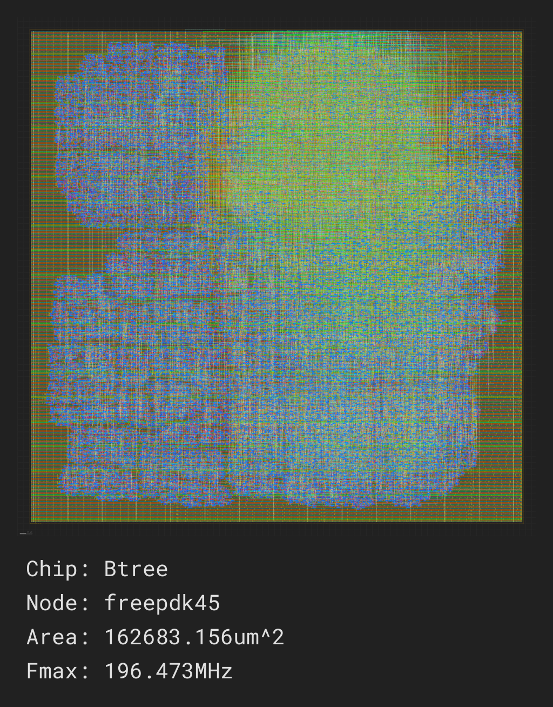
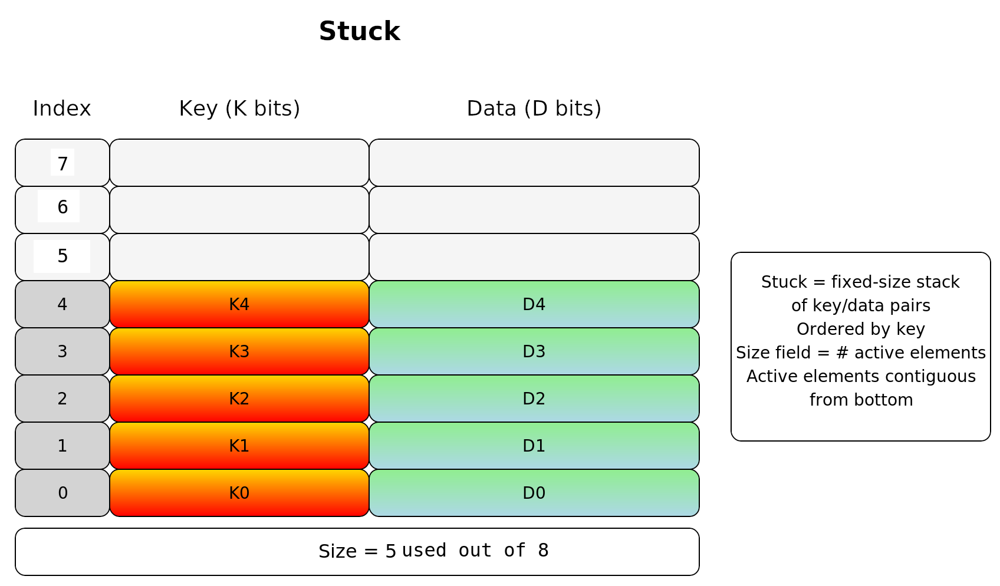

<div>
   <p><a href="https://github.com/philiprbrenan/btreeAsm"></a>
</div>

# Goal

Use [Java](https://en.wikipedia.org/wiki/Java_(programming_language)) to generate synthesizable [Verilog](https://en.wikipedia.org/wiki/Verilog) to layout a [B-Tree](https://en.wikipedia.org/wiki/B-tree) on the surface of
a specialized [Silicon](https://en.wikipedia.org/wiki/Silicon) [chip](https://en.wikipedia.org/wiki/Integrated_circuit) so that the [find](https://en.wikipedia.org/wiki/Find_(Unix)), put and delete operations on a [B-Tree](https://en.wikipedia.org/wiki/B-tree) can be performed more quickly than [software](https://en.wikipedia.org/wiki/Software) running on a generic
processor .



---

# Chip

A [chip](https://en.wikipedia.org/wiki/Integrated_circuit) implements an [algorithm](https://en.wikipedia.org/wiki/Algorithm) in [Silicon](https://en.wikipedia.org/wiki/Silicon). 
A [chip](https://en.wikipedia.org/wiki/Integrated_circuit) design exists in one of two states:

- **Design**: The stage where the layout of the [chip](https://en.wikipedia.org/wiki/Integrated_circuit) is defined on [Silicon](https://en.wikipedia.org/wiki/Silicon). 
- **Execution**: When the [chip](https://en.wikipedia.org/wiki/Integrated_circuit) runs a fixed set of parallel [processes](https://en.wikipedia.org/wiki/Process_management_(computing)) to perform work.

## Process

Each [process](https://en.wikipedia.org/wiki/Process_management_(computing)) is assigned a unique identifier at design time. A [process](https://en.wikipedia.org/wiki/Process_management_(computing)) includes:

- A [program](https://en.wikipedia.org/wiki/Computer_program), which in turn is comprised of [instructions](https://en.wikipedia.org/wiki/Instruction_set_architecture). 
- An optional block of [memory](https://en.wikipedia.org/wiki/Computer_memory) 
- Optional local [registers](https://en.wikipedia.org/wiki/Processor_register) 
### Access Rules

The [Verilog](https://en.wikipedia.org/wiki/Verilog) `always` blocks enforce access rule requirements for [processes](https://en.wikipedia.org/wiki/Process_management_(computing)): 
- A [process](https://en.wikipedia.org/wiki/Process_management_(computing)) can **only write** to its own [memory](https://en.wikipedia.org/wiki/Computer_memory) and [registers](https://en.wikipedia.org/wiki/Processor_register). 
- A [process](https://en.wikipedia.org/wiki/Process_management_(computing)) can **read** its own [registers](https://en.wikipedia.org/wiki/Processor_register) and the [registers](https://en.wikipedia.org/wiki/Processor_register) of **any** other [process](https://en.wikipedia.org/wiki/Process_management_(computing)) .

## Memory

The [memory](https://en.wikipedia.org/wiki/Computer_memory) associated with a [process](https://en.wikipedia.org/wiki/Process_management_(computing)) is comprised of one-dimensional, indexable [arrays](https://en.wikipedia.org/wiki/Dynamic_array): 
- Memory size is determined at **runtime**.

- Memory contents persist even when the [chip](https://en.wikipedia.org/wiki/Integrated_circuit) is not executing.

- Memory is typically accessed over multiple [clock](https://en.wikipedia.org/wiki/Clock_generator) cycles by issuing transactions that copy [memory](https://en.wikipedia.org/wiki/Computer_memory) elements to or from local [registers](https://en.wikipedia.org/wiki/Processor_register) for faster access.

- Each [memory](https://en.wikipedia.org/wiki/Computer_memory) is owned by a single [process](https://en.wikipedia.org/wiki/Process_management_(computing)) .

## Registers

Registers are local blocks of [memory](https://en.wikipedia.org/wiki/Computer_memory) that:

- Have a fixed size determined at **compile time**.

- Are accessible within a **single [clock](https://en.wikipedia.org/wiki/Clock_generator) cycle**.

- Lose their values if the [chip](https://en.wikipedia.org/wiki/Integrated_circuit) is powered off.

## Program Execution

Each [process](https://en.wikipedia.org/wiki/Process_management_(computing)) executes a single [program](https://en.wikipedia.org/wiki/Computer_program) composed of sequential [instructions](https://en.wikipedia.org/wiki/Instruction_set_architecture). A [chip](https://en.wikipedia.org/wiki/Integrated_circuit) may contain multiple [processes](https://en.wikipedia.org/wiki/Process_management_(computing)). 
Processes can be driven by transactions, which are parameter lists of [registers](https://en.wikipedia.org/wiki/Processor_register) provided by the calling [processes](https://en.wikipedia.org/wiki/Process_management_(computing)). 
Processes are execute in a fixed, round-robin order set at design time,
allowing the behavior of the [Verilog](https://en.wikipedia.org/wiki/Verilog) [code](https://en.wikipedia.org/wiki/Computer_program) to be validated by comparing the time
evolution of memories and [registers](https://en.wikipedia.org/wiki/Processor_register) under [Verilog](https://en.wikipedia.org/wiki/Verilog) with the trace of the same
under [Java](https://en.wikipedia.org/wiki/Java_(programming_language)). 
### Transactions

A [transaction](https://en.wikipedia.org/wiki/Database_transaction) enables one [process](https://en.wikipedia.org/wiki/Process_management_(computing)) to request work from another [process](https://en.wikipedia.org/wiki/Process_management_(computing)) using a parameter [list](https://en.wikipedia.org/wiki/Linked_list) comprised of [registers](https://en.wikipedia.org/wiki/Processor_register). 
Processes handle transactions in round-robin polling mode, fixed at design time. Each [process](https://en.wikipedia.org/wiki/Process_management_(computing)): 
1. Polls its inbound transactions for work.

2. When a [transaction](https://en.wikipedia.org/wiki/Database_transaction) is found:

   - Copies data from the transaction's parameter [registers](https://en.wikipedia.org/wiki/Processor_register) into its own [registers](https://en.wikipedia.org/wiki/Processor_register). 
   - Processes the data by executing the indicated [transaction](https://en.wikipedia.org/wiki/Database_transaction). 
   - Writes the execution results into the transaction's output [registers](https://en.wikipedia.org/wiki/Processor_register). 
   - Marks the [transaction](https://en.wikipedia.org/wiki/Database_transaction) as complete so that its results can be used by the caller.

3. The requesting [process](https://en.wikipedia.org/wiki/Process_management_(computing)) waits for the completion of a [transaction](https://en.wikipedia.org/wiki/Database_transaction) by spinning on an [instruction](https://en.wikipedia.org/wiki/Instruction_set_architecture). 
The output remains in the [transaction](https://en.wikipedia.org/wiki/Database_transaction) [registers](https://en.wikipedia.org/wiki/Processor_register) until they are overwritten by the next use of the same [transaction](https://en.wikipedia.org/wiki/Database_transaction). 
### Deadlock Prevention

To avoid deadlocks, [processes](https://en.wikipedia.org/wiki/Process_management_(computing)) may only request work from [processes](https://en.wikipedia.org/wiki/Process_management_(computing)) with lower [process](https://en.wikipedia.org/wiki/Process_management_(computing)) numbers.

## Verilog Implementation

The [chip](https://en.wikipedia.org/wiki/Integrated_circuit) is implemented in [Verilog](https://en.wikipedia.org/wiki/Verilog). Each [process](https://en.wikipedia.org/wiki/Process_management_(computing)) is mapped to an `always` block that:

- Executes [instructions](https://en.wikipedia.org/wiki/Instruction_set_architecture) comprising in-flight transactions or polls its non-in-flight transactions for work.

- Is triggered by a common [clock](https://en.wikipedia.org/wiki/Clock_generator) to ensure synchronous execution.

- Shares a common [clock](https://en.wikipedia.org/wiki/Clock_generator) cycle count (step number) across all [processes](https://en.wikipedia.org/wiki/Process_management_(computing)), though each [process](https://en.wikipedia.org/wiki/Process_management_(computing)) has its own [program](https://en.wikipedia.org/wiki/Computer_program) counter.

Programs are implemented using a `case` statement where:

- Each [instruction](https://en.wikipedia.org/wiki/Instruction_set_architecture) corresponds to a case branch.

- Each [process](https://en.wikipedia.org/wiki/Process_management_(computing)) has a [program](https://en.wikipedia.org/wiki/Computer_program) counter that selects the next [instruction](https://en.wikipedia.org/wiki/Instruction_set_architecture) to be executed.

This is **not** a general-purpose processor. It is a specialized [chip](https://en.wikipedia.org/wiki/Integrated_circuit) with **statically optimized** execution paths for minimal time and power consumption.

## Java Simulation

Writing [Verilog](https://en.wikipedia.org/wiki/Verilog) directly is time-consuming and error-prone. To mitigate this problem:

- The [algorithm](https://en.wikipedia.org/wiki/Algorithm) is first written and debugged in [Java](https://en.wikipedia.org/wiki/Java_(programming_language)) using familiar programming paradigms and tools.

- The [Java](https://en.wikipedia.org/wiki/Java_(programming_language)) [code](https://en.wikipedia.org/wiki/Computer_program) is then **almost-automatically translated** into [Verilog](https://en.wikipedia.org/wiki/Verilog). 
- The [Java](https://en.wikipedia.org/wiki/Java_(programming_language)) [code](https://en.wikipedia.org/wiki/Computer_program) is executed to produce a trace showing how the [memory](https://en.wikipedia.org/wiki/Computer_memory) and [registers](https://en.wikipedia.org/wiki/Processor_register) of the chip should evolve in time.

- The [Verilog](https://en.wikipedia.org/wiki/Verilog) [code](https://en.wikipedia.org/wiki/Computer_program) is executed and checked to confirm that it produces the same [memory](https://en.wikipedia.org/wiki/Computer_memory) and [register](https://en.wikipedia.org/wiki/Processor_register) trace as the [Java](https://en.wikipedia.org/wiki/Java_(programming_language)) [code](https://en.wikipedia.org/wiki/Computer_program) does

This approach produces [Verilog](https://en.wikipedia.org/wiki/Verilog) [code](https://en.wikipedia.org/wiki/Computer_program) **more efficiently** and **reliably** than
writing it by hand.

As a consequence, no additional tests are required within the [Verilog](https://en.wikipedia.org/wiki/Verilog) [code](https://en.wikipedia.org/wiki/Computer_program) itself; it is sufficient to [verify](https://en.wikipedia.org/wiki/Software_verification_and_validation) that the [Verilog](https://en.wikipedia.org/wiki/Verilog) implementation updates the [memory](https://en.wikipedia.org/wiki/Computer_memory) and [registers](https://en.wikipedia.org/wiki/Processor_register) on the chip in lockstep with the [Java](https://en.wikipedia.org/wiki/Java_(programming_language)) version to confirm
that the [Verilog](https://en.wikipedia.org/wiki/Verilog) version accurately represents the [Java](https://en.wikipedia.org/wiki/Java_(programming_language)) version.

If the [Verilog](https://en.wikipedia.org/wiki/Verilog) trace and the [Java](https://en.wikipedia.org/wiki/Java_(programming_language)) trace do not match, the [instruction](https://en.wikipedia.org/wiki/Instruction_set_architecture) that is
causing the mismatch can be located by setting "processTrace" to **true** for
the [process](https://en.wikipedia.org/wiki/Process_management_(computing)) under development to get a traceback identifying the [instruction](https://en.wikipedia.org/wiki/Instruction_set_architecture) that is executing differently in the [Java](https://en.wikipedia.org/wiki/Java_(programming_language)) version versus the [Verilog](https://en.wikipedia.org/wiki/Verilog) version.

---

# Stuck Data Structure

A **Stuck** serves as the **fundamental node representation** inside a **B-tree**.
Instead of using pointers to dynamically allocated elements, each node of the B-tree contains a **Stuck** that stores its **keys and associated values (or child pointers)** in a fixed-size, contiguous block.

A **Stuck** is a **fixed-size stack-like array** designed to hold **key–data pairs** in **sorted order by key**.



A **Stuck** combines the **boundedness of a stack**, the **ordered nature of a sorted array**, and the **explicit size field** to manage contiguous usage efficiently.

---

## Storage Layout
- Implemented as a **contiguous [array](https://en.wikipedia.org/wiki/Dynamic_array) of slots**.
- Each slot contains:
  - **Key field** (`K bits`)
  - **Data field** (`D bits`)
- The structure has a **fixed capacity** `N`.

---

## Active Region
- The Stuck maintains a **size field** that records how many slots are currently in use.
- **Active elements** occupy indices `0` through `size-1`, starting from the **bottom**.
- All higher indices are **unused (empty)**.

---

## Ordering
- Keys in the active region are maintained in **sorted order**.
- Insertions require shifting elements upward to preserve ordering.
- Removals require shifting elements downwards to preserve ordering.

---

## Operations
- **Insert(Index, Key, Data)**
  Insert a new key–data pair into the correct position. May require shifting.
  If the structure is full, insertion fails.

- **Remove(Index)**
  Remove a key–data pair at the specified index, shifting elements down to maintain contiguity.

- **Search(Key)**
  Perform linear or binary search over the active region.

- **Size()**
  Return the number of active elements.

---

## Properties
- Fixed capacity (like an array).
- Maintains **keys in sorted order**.
- **Active elements are contiguous** from the bottom up.
- **Fast access** to elements by index.

---

# Role in a B-tree

1. **Key Storage**
   - Each B-tree node maintains its set of keys inside a Stuck.
   - The Stuck keeps keys **sorted**, which is crucial for search, insert, and delete operations in a B-tree.

2. **Efficient Search**
   - Because keys in a Stuck are ordered, **binary search** can be applied within the node.
   - This reduces search cost inside a node from linear to logarithmic.

3. **Insert & Split Support**
   - When inserting a key into a node, the Stuck shifts entries to maintain sorted order.
   - If the Stuck is full, the node **splits**: half the keys are promoted or moved to a new node, consistent with B-tree balancing rules.

4. **Delete & Merge Support**
   - On deletion, the Stuck shifts entries downward to close gaps.
   - If underflow occurs, merging or borrowing between nodes uses Stuck operations to re-balance.

5. **Child Pointers**
   - In internal nodes, each Stuck entry may also hold a **pointer/reference to a child Stuck** (i.e., another node).
   - Thus, the Stuck serves as both a **container of keys** and a **directory of child subtrees**.

## Why a Stuck is a Good Fit

- **Contiguous [memory](https://en.wikipedia.org/wiki/Computer_memory) layout** : cache-friendly.
- **Fixed capacity** : simplifies [memory](https://en.wikipedia.org/wiki/Computer_memory) management.
- **Size field** : explicitly tracks how full the node is.
- **Ordered** maintains the keys in order so they can be searched quickly

---

# Silicon Compiler

The [Verilog](https://en.wikipedia.org/wiki/Verilog) produced by **Btree.java** is transformed into a chip [mask](https://en.wikipedia.org/wiki/Integrated_circuit_layout) using [Open Source Silicon Compiler](https://docs.siliconcompiler.com/en/latest/index.html) .

## Install OpenROAD in a [Docker](https://en.wikipedia.org/wiki/Docker_(software)) container

OpenRoad is needed by Silicon Compiler to do layout.

And OpenRoad is not available for Ubuntu 24 so we have to use a [Docker](https://en.wikipedia.org/wiki/Docker_(software)) container:

```
docker run -it --rm ubuntu:22.04 /bin/bash
```

Install the following **deb** [file](https://en.wikipedia.org/wiki/Computer_file): 
```
wget https://github.com/Precision-Innovations/OpenROAD/releases/download/2024-12-14/openroad_2.0-17598-ga008522d8_amd64-ubuntu-22.04.deb
apt install ...deb
openroad -V
```

## Install Silicon compiler

Create a [Python](https://www.python.org/) virtual environment, activate it, [install](https://en.wikipedia.org/wiki/Installation_(computer_programs)) [Open Source Silicon Compiler](https://docs.siliconcompiler.com/en/latest/index.html) and conform the installation .

```
sudo apt update
sudo apt install python3-dev python3-pip python3-venv
python3 -m venv  ./sc
source ./sc/bin/activate
pip install --upgrade pip siliconcompiler
pip show siliconcompiler
python3 -c "import siliconcompiler;print(siliconcompiler.__version__)"
```

## Install Yosys

Download **yosys**:

```
wget https://github.com/YosysHQ/oss-cad-suite-build/releases/download/2025-08-24/oss-cad-suite-linux-x64-20250824.tgz
tar -xvf
export PATH="$PATH:/root/oss-cad-suite/bin/"
yosys -V
```

## Install Klayout

Install **Klayout**

```
wget https://www.klayout.org/downloads/master/ubuntu22/klayout_master-1_amd64.deb
klayout -v
```

# Upload to Github containers

To save the configured container to [GitHub](https://github.com/philiprbrenan): 
## 1. Log in to GHCR

```
echo <.githubToken.xxx> | docker login ghcr.io -u philiprbrenan --password-stdin
```

## 2. Tag your image

Make an image from the [Docker](https://en.wikipedia.org/wiki/Docker_(software)) container:

```
docker commit <container> btreeasm:v1
```

## 3. Tag your image

Give the [Docker](https://en.wikipedia.org/wiki/Docker_(software)) image a name that [GitHub](https://github.com/philiprbrenan) can recognize:

```
docker tag btreeasm:v1 ghcr.io/philiprbrenan/btreeasm:v1
```

## 4. Push the image

Push the [Docker](https://en.wikipedia.org/wiki/Docker_(software)) image to [GitHub](https://github.com/philiprbrenan): 
```
docker push ghcr.io/philiprbrenan/btreeasm:v1
```

## 5. (Optional) Make the package public

Make the [Docker](https://en.wikipedia.org/wiki/Docker_(software)) image public:

```
https://github.com/users/philiprbrenan/packages/container/package/btreeAsm
```

Then: Package Settings → Change visibility → Public


# Status

- 2025-07-12 [Java](https://en.wikipedia.org/wiki/Java_(programming_language)) implementation of the [B-Tree](https://en.wikipedia.org/wiki/B-tree) [algorithm](https://en.wikipedia.org/wiki/Algorithm) 
- 2025-08-15 [Verilog](https://en.wikipedia.org/wiki/Verilog) trace matches [Java](https://en.wikipedia.org/wiki/Java_(programming_language)) trace

- 2025-08-16 [Verilog](https://en.wikipedia.org/wiki/Verilog) synthesized for [test](https://en.wikipedia.org/wiki/Software_testing) cases in Chip.java using yosys

- 2025-08-22 All [Verilog](https://en.wikipedia.org/wiki/Verilog) now uses non blocking assignment

- 2025-08-24 Place and route of synthesized [Verilog](https://en.wikipedia.org/wiki/Verilog) using [Open Source Silicon Compiler](https://docs.siliconcompiler.com/en/latest/index.html) 