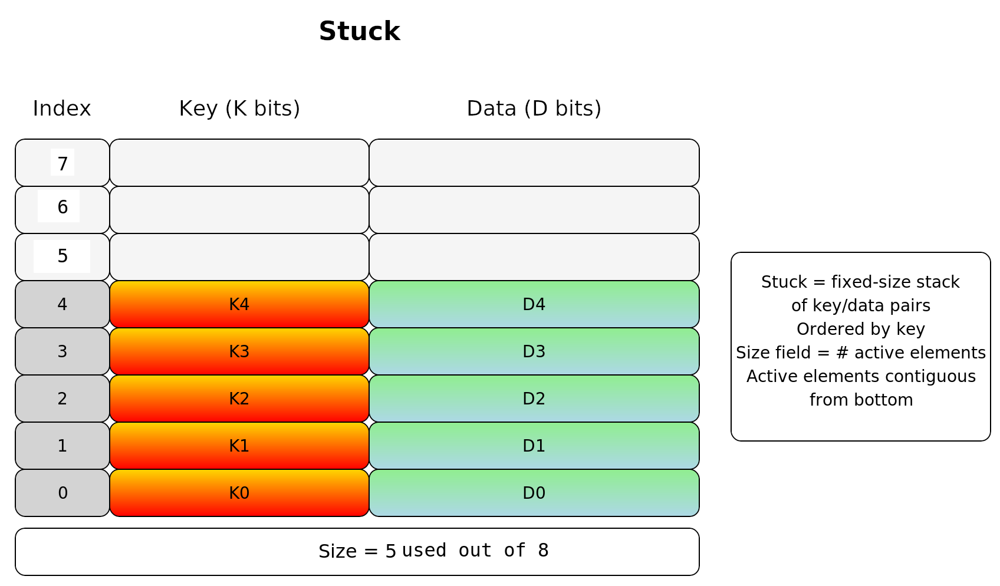

# Stuck Data Structure

A **Stuck** is a **fixed-size stack-like array** designed to hold **key–data pairs** in **sorted order by key**.

A **Stuck** combines the **boundedness of a stack**, the **ordered nature of a sorted array**, and the **explicit size field** to manage contiguous usage efficiently.

---

## Storage Layout
- Implemented as a **contiguous array of slots**.
- Each slot contains:
  - **Key field** (`K bits`)
  - **Data field** (`D bits`)
- The structure has a **fixed capacity** `N`.

---

## Active Region
- The Stuck maintains a **size field** that records how many slots are currently in use.
- **Active elements** occupy indices `0` through `size-1`, starting from the **bottom**.
- All higher indices are **unused (empty)**.

---

## Ordering
- Keys in the active region are maintained in **sorted order**.
- Insertions require shifting elements upward to preserve ordering.
- Removals require shifting elements downwards to preserve ordering.

---

## Operations
- **Insert(Index, Key, Data)**
  Insert a new key–data pair into the correct position. May require shifting.
  If the structure is full, insertion fails.

- **Remove(Index)**
  Remove a key–data pair at the specified index, shifting elements down to maintain contiguity.

- **Search(Key)**
  Perform linear or binary search over the active region.

- **Size()**
  Return the number of active elements.

---

## Properties
- Fixed capacity (like an array).
- Maintains **keys in sorted order**.
- **Active elements are contiguous** from the bottom up.
- **Fast access** to elements by index.

---

# Role of a Stuck in a B-tree

A **Stuck** serves as the **fundamental node representation** inside a **B-tree**.
Instead of using pointers to dynamically allocated elements, each node of the B-tree contains a **Stuck** that stores its **keys and associated values (or child pointers)** in a fixed-size, contiguous block.

## Role in a B-tree

1. **Key Storage**
   - Each B-tree node maintains its set of keys inside a Stuck.
   - The Stuck keeps keys **sorted**, which is crucial for search, insert, and delete operations in a B-tree.

2. **Efficient Search**
   - Because keys in a Stuck are ordered, **binary search** can be applied within the node.
   - This reduces search cost inside a node from linear to logarithmic.

3. **Insert & Split Support**
   - When inserting a key into a node, the Stuck shifts entries to maintain sorted order.
   - If the Stuck is full, the node **splits**: half the keys are promoted or moved to a new node, consistent with B-tree balancing rules.

4. **Delete & Merge Support**
   - On deletion, the Stuck shifts entries downward to close gaps.
   - If underflow occurs, merging or borrowing between nodes uses Stuck operations to re-balance.

5. **Child Pointers**
   - In internal nodes, each Stuck entry may also hold a **pointer/reference to a child Stuck** (i.e., another node).
   - Thus, the Stuck serves as both a **container of keys** and a **directory of child subtrees**.

## Why a Stuck is a Good Fit

- **Contiguous memory layout** → cache-friendly.
- **Fixed capacity** → simplifies memory management.
- **Size field** → explicitly tracks how full the node is.
- **Order maintenance** maintains the keys in order so they can be searched quickly

---
